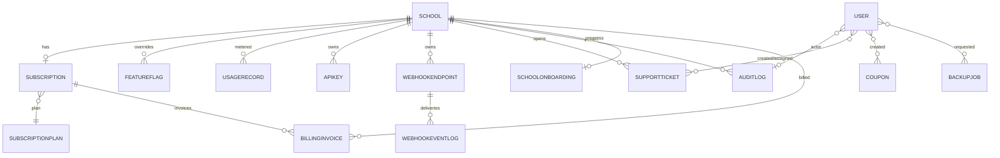

# EduFlow — Database Guide (Phase 9)

PostgreSQL via Prisma 5. Pooled URL for the app; direct URL for migrations.

## Phase 9 additions

**Enums:** `SubscriptionStatus`, `SubscriptionCycle`, `BillingProvider`,
`BillingInvoiceStatus`, `CouponDiscountType`, `SupportTicketStatus`,
`SupportTicketPriority`, `UsageMetric`, `FeatureModule`, `BackupJobStatus`,
`EmailLogStatus`, `WebhookEventStatus`.

**Models** (see `prisma/schema.prisma` for the full DDL):



Key uniqueness/constraints:

- `Subscription.schoolId` — unique (one subscription per school).
- `FeatureFlag(schoolId, module)` — unique (one override per module).
- `UsageRecord(schoolId, metric, period)` — unique (upsert targets).
- `ApiKey.keyHash` — unique; `Coupon.code` — unique;
  `BillingInvoice.number` — unique.
- `PlatformSettings.id = 1` — enforced singleton.

## Data hygiene notes

- `BillingInvoice` (platform, subscription billing) is deliberately
  distinct from the school fee `Invoice` model (Phases 5) — same word,
  different domain; don't merge them.
- Money: `Int` minor units in Phase 9 models (`amountMinor`); the school
  fee models use `Decimal(10,2)` majors. Convert at boundaries.
- `UsageRecord.value` is an `Int` counter per `YYYY-MM` UTC period.
- Soft-delete is not used for tenants: `School.status` (ACTIVE/SUSPENDED)
  is the control; audit logs keep history.
- Never delete a `SubscriptionPlan` that has subscriptions — deactivate it
  instead (API enforces this).

## Migrations

```bash
npx prisma migrate dev --name phase9     # local, creates migration SQL
npm run db:deploy                        # production (uses DIRECT_URL)
```
